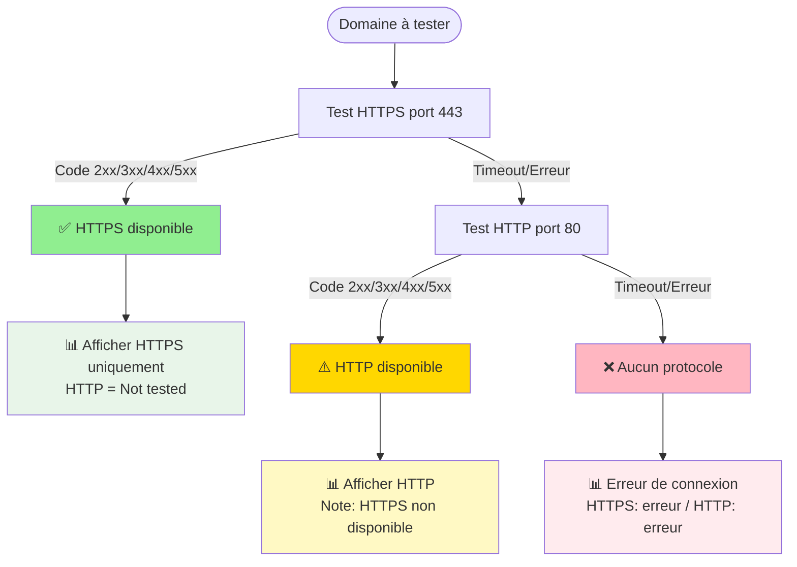

# 🌐 DNS to Mermaid Converter & Validator

**Outil complet pour visualiser, valider et documenter vos configurations DNS.**

[](https://nodejs.org/)
[](LICENSE)

> 🌍 **Disponible en plusieurs langues :**
> - 🇬🇧 [English Demo](https://a-scolan.github.io/DNS2Mermaid/) | [English README](README.md)
> - 🇫🇷 [Demo Français](https://a-scolan.github.io/DNS2Mermaid/index.fr.html) | [README Français](README.fr.md)

---

## 🚀 Démarrage Rapide

### Installation

```bash
# 1. Cloner le dépôt
git clone https://github.com/a-scolan/DNS2Mermaid.git
cd DNS2Mermaid

# 2. Installer les dépendances
npm install

# 3. Vérifier l'installation
node dns2mermaid.js --help
```

**Prérequis** : Node.js 14+ (vérifié avec `node --version`)

### Utilisation Basique

```bash
# 1. Créer votre fichier input.csv (voir Format CSV ci-dessous)
# Exemple : TTL,Name,Type,Value,View
#           3600,example.com,A,203.0.113.10,ext

# 2. Lancer la conversion
node dns2mermaid.js
# OU
npm start

# 3. Fichiers générés :
#    ✅ output.mmd             (Diagramme Mermaid)
#    ✅ output.svg             (Image vectorielle)
#    ✅ legend.svg             (Légende)
#    ✅ validation_report.txt  (Rapport RFC + SSL + HTTP)
#    ✅ analysis_report.csv    (Rapport CSV enrichi)
#    ✅ analysis_report.csv    (Rapport CSV enrichi)

# 4. Voir la démo
npm run demo
```

### Scripts npm Disponibles

```bash
npm start                 # Lancer la conversion (input.csv par défaut)
npm test                  # Lancer tous les tests (DNS + Email)
npm run test:dns          # Tests validation DNS uniquement
npm run test:email        # Tests validation Email uniquement
npm run test:ignore       # Tests règles ignorées
npm run demo              # Générer la démo (demo/demo_complete.csv)
npm run analyze           # Analyse dossier avec --folder (nécessite paramètres)
npm run validate          # Analyse avec --email-validation
```

---

## 📄 Format du Fichier CSV

**Colonnes détectées automatiquement** (délimiteur `,` ou `;` auto-détecté) :

| Colonne | Synonymes Acceptés | Obligatoire | Exemples |
|---------|-------------------|-------------|----------|
| **Name** | `Name`, `RRName`, `RR_Name`, `hostname`, `FQDN` | ✅ Oui | `www.example.com`, `mail.example.com` |
| **Type** | `Type`, `Record_Type`, `RRType`, `RR_Type` | ✅ Oui | `A`, `AAAA`, `CNAME`, `MX`, `NS`, `TXT` |
| **Value** | `Value`, `Data`, `RData`, `Target` | ✅ Oui | `192.168.1.10`, `mail.example.com`, `10 mx.example.com` |
| **TTL** | `TTL` | ⚠️ Optionnel (défaut: 3600) | `300`, `3600`, `86400` |
| **View** | `View`, `Vues`, `Views` | ⚠️ Optionnel (défaut: "default") | `int`/`priv` (🔵), `ext`/`pub` (🟢) |

**🔄 Ordre des colonnes flexible** : Les colonnes peuvent être dans n'importe quel ordre !

**Exemple complet :**

```csv
TTL,Name,Type,Value,View
3600,example.com,A,203.0.113.10,ext
3600,example.com,MX,10 mail.example.com,ext
300,www.example.com,CNAME,example.com,ext
3600,mail.example.com,A,203.0.113.50,ext
3600,mail.example.com,AAAA,2001:db8::50,ext
300,db.example.com,A,192.168.1.100,int
3600,example.com,TXT,"v=spf1 mx ~all",ext
```

📖 **Types supportés** : `A`, `AAAA`, `CNAME`, `MX`, `NS`, `TXT`, `SOA`, `PTR`, `SRV`  
📖 **Bonnes pratiques DNS** : Voir [DNS_Best_Practices.md](./DNS_Best_Practices.md)

---

## 🛠️ Options de Commande

### Commandes Essentielles

```bash
# Fichiers personnalisés
node dns2mermaid.js -i zones.csv -o diagram.mmd -r report.txt

# Layout optimisé pour grandes infrastructures
node dns2mermaid.js --compact-layout

# Validation email complète (SPF, DKIM, DMARC)
node dns2mermaid.js --email-validation

# Ignorer certaines règles (séparées par virgules)
node dns2mermaid.js --ignore-rules MISSING_IPV6,TTL_TOO_SHORT

# Désactiver validation SSL (gain de temps)
node dns2mermaid.js --no-ssl-check

# Désactiver validation HTTP/HTTPS (activée par défaut)
node dns2mermaid.js --no-http-check

# Masquer les timeouts SSL (garder autres erreurs)
node dns2mermaid.js --ssl-no-timeout-errors

# Mode batch (traiter un dossier entier)
node dns2mermaid.js --folder ./mes-zones

# Rapport seul sans diagramme (mode CI/CD)
node dns2mermaid.js --no-diagram -r report.txt

# Validation complète (DNS + SSL + HTTP/HTTPS + Email)
node dns2mermaid.js --email-validation

# Mode silencieux (pour scripts)
node dns2mermaid.js --quiet
```

### Référence Complète

| Option | Valeur | Défaut | Description |
|--------|--------|--------|-------------|
| `-i`, `--input` | `<file>` | `input.csv` | Fichier CSV source |
| `-o`, `--output` | `<file>` | `output.mmd` | Fichier Mermaid |
| `-l`, `--legend` | `<file>` | `legend.mmd` | Fichier légende |
| `-r`, `--report` | `<file>` | `validation_report.txt` | Rapport validation |
| `--csv-report` | `<file>` | `analysis_report.csv` | Rapport CSV enrichi avec colonnes d'analyse |
| `--no-csv-report` | - | - | Désactiver génération rapport CSV (activé par défaut) |
| `--svg` | `<file>` | `output.svg` | Export SVG principal |
| `--legend-svg` | `<file>` | `legend.svg` | Export SVG légende |
| `--direction` | `TB\|LR\|RL\|BT` | `LR` | Sens du diagramme (horizontal par défaut) |
| `--compact-layout` | - | - | Layout optimisé (espacement réduit) |
| `--scale` | `<number>` | `2` | Échelle export SVG |
| `--background` | `<color>` | `white` | Couleur fond SVG |
| `--folder` | `<dir>` | - | Mode batch (traite tous les CSV) |
| `--ssl-port` | `<port>` | `443` | Port SSL à vérifier |
| `--no-ssl-check` | - | - | Désactiver validation SSL (activée par défaut) |
| `--ssl-no-timeout-errors` | - | - | Masquer les erreurs de timeout SSL |
| `--no-http-check` | - | - | **Désactiver validation HTTP/HTTPS (activée par défaut)** |
| `--http-timeout` | `<ms>` | `5000` | Timeout HTTP en millisecondes |
| `--email-validation` | - | - | Validation email (SPF, DKIM, DMARC) |
| `--ignore-rules` | `<rules>` | - | Ignorer règles (ex: `MISSING_IPV6,TTL_TOO_SHORT`) |
| `--no-validation` | - | - | Désactiver validation RFC |
| `--no-diagram` | - | - | **Désactiver génération diagramme (rapport seul)** |
| `--no-legend` | - | - | Ne pas générer la légende |
| `--no-export` | - | - | Pas d'export SVG |
| `--show-orphans` | - | - | Afficher nœuds externes non résolus (désactivé par défaut) |
| `--quiet` | - | - | Mode silencieux |
| `-h`, `--help` | - | - | Aide complète |

**Voir toutes les options** : `node dns2mermaid.js --help`

---

## 📊 Ce que Génère l'Outil

### 1. Diagramme Mermaid Interactif

**Visualisation automatique de :**

- 🏗️ **Enregistrements DNS** (groupés par domaine dans des subgraphs)
- 🌐 **Nœuds IP uniques** (avec compteur d'utilisation `×utilisé`)
- 🔗 **Relations** (CNAME →, MX →, NS →, A/AAAA → IP avec flèche `resolves`)
- 🔵🟢🟣 **Vues DNS** (Interne, Externe, Interne & Externe)
- 🚨⚠️ℹ️ **Violations RFC** (3 niveaux de sévérité avec compteur)
- 🔒 **Certificats SSL/TLS** (expiration, CN, SAN, émetteur)
- 🟩🟨🟥 **Statuts HTTP/HTTPS** (activé par défaut, désactiver avec `--no-http-check`) : Labels texte intégrés dans les records A/AAAA/CNAME
  - Format : `HTTPS:200`, `HTTP:404`, `HTTP/S:KO` (protocole + code statut)
  - 🟩 **Vert** : HTTP/HTTPS 2xx (succès)
  - 🟨 **Jaune** : HTTP/HTTPS 3xx/4xx/5xx (répond mais erreur)
  - 🟥 **Rouge** : Aucune réponse (timeout, connection refused)
  - Priorité HTTPS > HTTP dans l'affichage
- 🌍⚠️ **Alertes ségrégation** (IP privée RFC 1918 exposée en vue externe)

**Styles visuels spécifiques :**
- **Violations CRITICAL** : Fond rouge `#ffe0e0`, bordure rouge épaisse, tirets
- **IP privée** : 🔵 Fond bleu `#b3d9ff`, bordure `#0066cc` (cohérent avec vue interne)
- **IP publique** : 🟢 Fond vert `#b3ffb3`, bordure `#006600` (cohérent avec vue externe)
- **IP privée exposée** : Fond rose `#ffebee`, bordure magenta `#e91e63`, icône `🌍⚠️`
- **WARNING** : Bordure orange `#ff8800` épaisse
- **INFO** : Bordure jaune `#ccaa00`, tirets
- **Subgraphs violés** : Fond teinté selon sévérité (rouge/orange/jaune)

**Configuration YAML automatique** :
```yaml
config:
  flowchart:
    htmlLabels: true        # Support HTML dans labels
    curve: basis            # Courbes fluides
    padding: 25             # Espacement interne subgraphs
    diagramPadding: 8       # Marge globale
    wrappingWidth: 200      # Limite débordements
```

### 2. Rapport de Validation Automatique

Le fichier `validation_report.txt` inclut :

✅ **Validation RFC** (19 règles)
- 🚨 **CRITICAL** (7 règles) : Violations bloquantes
  - CNAME_COEXISTENCE, CNAME_ON_APEX, CNAME_LOOP
  - MX_TO_CNAME, NS_TO_CNAME, MX_NO_GLUE, NS_NO_GLUE
  - SPF_TOO_PERMISSIVE
  
- ⚠️ **WARNING** (6 règles) : Problèmes à corriger rapidement
  - CNAME_CHAIN, INCONSISTENT_TTL, TTL_TOO_SHORT
  - SPF_NEUTRAL, MX_ORPHAN, NS_ORPHAN
  - VIEW_SEGREGATION_PRIVATE_EXTERNAL (**règle clé** : IP RFC 1918 exposée)
  
- ℹ️ **INFO** (6 règles) : Bonnes pratiques
  - MISSING_IPV6, TTL_TOO_LONG, WILDCARD_RESTRICTION
  - DUPLICATE_RECORD, CNAME_ORPHAN (si `--show-orphans`)
  - INCONSISTENT_TTL_MULTIVIEW (TTL différents entre vues)

✅ **Validation SSL/TLS** (activée par défaut)
- 🔴 **CRITICAL** : Certificat expiré ou < 7 jours
- 🟠 **WARNING** : Expire dans 7-21 jours
- 🟢 **OK** : > 21 jours
- ❌ **ERRORS** : Timeout, erreurs connexion
- 🚀 **Parallélisation** : 40 vérifications simultanées pour des performances optimales

✅ **Validation HTTP/HTTPS** (activée par défaut, désactiver avec `--no-http-check`)-no-http-check`)
- ✅ **2xx (Succès)** : Domaine accessible
- 🔀 **3xx (Redirections)** : Vérifier configuration
- ⚠️ **4xx (Erreur client)** : Domaine accessible mais erreur
- 🚨 **5xx (Erreur serveur)** : Problème backend
- ❌ **Timeout/Connexion** : Serveur injoignable
- 🎯 **Résolution DNS forcée** : Utilise les IPs du CSV, pas la résolution système
- 🔗 **Suivi des CNAMEs** : Résout automatiquement les chaînes CNAME→IP
- 📊 **Barre de progression** : Affiche l'avancement des vérifications HTTP/HTTPS
- 🚀 **Parallélisation** : 40 requêtes HTTP/HTTPS simultanées (HTTP et HTTPS testés en parallèle)
- ⚡ **Optimisation SSL** : Si la validation SSL est activée en même temps, les domaines ayant un certificat SSL valide sont automatiquement marqués comme HTTPS disponible (économie de requêtes)
- 📝 **Affichage dans le diagramme** : Labels texte avec protocole et code statut (`HTTPS:200`, `HTTP:404`, `HTTP/S:KO`)
- ℹ️  **Note** : Les zones DNS inverses (`*.in-addr.arpa`, `*.ip6.arpa`) sont automatiquement exclues de la validation SSL car ce sont des zones techniques pour la résolution PTR qui ne peuvent pas avoir de certificats

**Structure du rapport :**
```
═══════════════════════════════════════════════════════════
           RAPPORT DE VALIDATION DNS RFC
              & CERTIFICATS SSL/TLS
═══════════════════════════════════════════════════════════

Date: 2024-01-15T10:30:00.000Z
Fichier source: input.csv
Domaines analysés: 15
Violations détectées: 3

CERTIFICATS SSL/TLS VÉRIFIÉS: 12
🟢 OK (>21j): 8
⚠️  WARNING (7-21j): 2
🚨 CRITICAL (<7j): 1
❌ ERREURS: 1

🚨 Violations BLOQUANTES (CRITICAL): 1
⚠️  Problèmes à corriger (WARNING): 1
ℹ️  Bonnes pratiques (INFO): 1

───────────────────────────────────────────────────────────

🚨 VIOLATIONS BLOQUANTES (À CORRIGER IMMÉDIATEMENT):

1. [CNAME_COEXISTENCE] www.example.com
   CNAME ne peut pas coexister avec d'autres types (A)
   Référence: RFC 1034 Section 3.6.2
   Enregistrements affectés: CNAME example.com, A 203.0.113.10

⚠️  PROBLÈMES À CORRIGER RAPIDEMENT:

1. [VIEW_SEGREGATION_PRIVATE_EXTERNAL] api.example.com
   IP privée RFC 1918 (192.168.1.50) exposée en vue externe - Fuite d'information réseau
   Référence: RFC 1918 Section 3 + Bonne pratique sécurité
   Enregistrements affectés: A 192.168.1.50

───────────────────────────────────────────────────────────
RÈGLES VALIDÉES (17 règles, 3 niveaux):
[Liste complète des règles avec références RFC]

═══════════════════════════════════════════════════════════
            CERTIFICATS SSL/TLS À RENOUVELER
═══════════════════════════════════════════════════════════

🚨 CERTIFICATS EXPIRÉS OU EXPIRANT SOUS 7 JOURS:

1. old.example.com
   🚨 Expire dans 3 jour(s)
   Émetteur: Let's Encrypt
   Valide jusqu'au: 2024-01-18
   Domaines couverts (3):
     - old.example.com
     - www.old.example.com
     - api.old.example.com
```

📖 **Guide complet des règles RFC** : [DNS_Best_Practices.md](./DNS_Best_Practices.md#-règles-rfc-strictes-à-respecter)

---

## 🎯 Fonctionnalités Avancées

### Visualisation des Adresses IP

**Les nœuds IP sont automatiquement générés** pour chaque adresse unique détectée dans les enregistrements A/AAAA.

**Caractéristiques :**
- 🔷 **Forme parallélogramme** `[[...]]` pour distinction visuelle
- 📊 **Compteur d'utilisation** : `3×utilisé` (détecte IP mutualisées)
- 🔗 **Flux de résolution** : `Enregistrement A/AAAA -->|resolves| Nœud IP`
- 🎨 **Regroupement** dans subgraph `ip_cluster` avec direction `LR` (horizontal)
- 📍 **Création des liens après le subgraph** (meilleur rendu layout)

**Détails techniques :**
```javascript
// Création du nœud IP lors du parsing
if (type === 'A' || type === 'AAAA') {
    if (!ipNodes[value]) {
        ipNodes[value] = {
            id: sanitizeId(`IP_${value}`),
            ip: value,
            type: type,
            usedBy: []  // Liste des enregistrements pointant vers cette IP
        };
    }
    ipNodes[value].usedBy.push({ fqdn: rrName, recordId: uniqueNodeId });
}
```

**Rendu Mermaid :**
```mermaid
node_IP_203_0_113_10[["IPv4 | 203.0.113.10 | 3×utilisé"]]
```
Note : La syntaxe `[[...]]` génère un parallélogramme (double-bord). Pour référence :
- `[...]` = Rectangle
- `[[...]]` = Parallélogramme/Subgraph node
- `{...}` = Losange
- `{{...}}` = Hexagone
- `((...))` = Cercle

**Cas d'usage :**
- Identifier les IP partagées (load balancing, CDN)
- Détecter les configurations potentiellement problématiques
- Auditer la répartition des services

### Détection des Certificats SSL/TLS

**Vérification automatique des certificats** de tous les domaines résolvables (port 443 par défaut).

**Domaines vérifiés :**
- ✅ Avec enregistrement A/AAAA
- ❌ Exclut : Wildcards (`*.example.com`), DKIM (`_domainkey`), DMARC (`_dmarc`), techniques (`_*`)

**Filtrage dans le code :**
```javascript
const domainsToCheck = Object.keys(domains).filter(fqdn => 
    !fqdn.startsWith('*') &&
    !fqdn.startsWith('_dmarc') &&
    !fqdn.startsWith('_domainkey') &&
    !fqdn.includes('._domainkey.') &&
    !fqdn.startsWith('_')
);
```

**Regroupement intelligent :**
- Un seul nœud SSL pour les certificats multi-domaines (SAN)
- Identification par `certId` (fingerprint ou serialNumber)
- Affichage des 5 premiers SAN + compteur `...` si plus
- Troncature : CN max 30 car, SAN max 25 car, Émetteur max 20 car

**Format des nœuds SSL :**
```mermaid
SSL_xxx{{"🔒 SSL | CN:example.com | SAN:www,api,mail,... | 8×dom | 89j | Let's Encrypt"}}
```

**Vérification parallèle :**
- Batchs de 40 domaines simultanés (optimisé pour hautes performances)
- Timeout 5 secondes par domaine
- Barre de progression en temps réel

**Personnalisation :**

```bash
# Port personnalisé (dev, staging)
node dns2mermaid.js --ssl-port 8443

# Désactiver (gain de temps sur gros datasets)
node dns2mermaid.js --no-ssl-check

# Désactiver validation HTTP/HTTPS également
node dns2mermaid.js --no-ssl-check --no-http-check
```

### Validation HTTP/HTTPS

**Stratégie HTTPS-FIRST** : Teste la disponibilité web en privilégiant la sécurité.

#### 🔄 Arbre de Décision



**Exemples de résultats :**

| Scénario | HTTPS | HTTP | Rapport | Catégorie |
|----------|-------|------|---------|-----------|
| Site moderne | ✅ 200 OK | Non testé | `✅ HTTPS: 200 OK` | Accessible (2xx) |
| Redirection HTTPS | ✅ 301 | Non testé | `🔀 HTTPS: 301` | Redirection (3xx) |
| Site ancien | ❌ Timeout | ✅ 200 OK | `⚠️ HTTP: 200 (fallback)` | Accessible (2xx) |
| Erreur serveur | ✅ 500 | Non testé | `🚨 HTTPS: 500` | Erreur serveur (5xx) |
| Site down | ❌ Timeout | ❌ Refused | `❌ Erreurs connexion` | Inaccessible |

**Avantages :**
- 🔒 Privilégie HTTPS (sécurité)
- ⚡ ~50% moins de requêtes (pas de test HTTP inutile)
- 📊 Pas de faux warning pour redirection HTTP→HTTPS
- 🎯 Rapport CSV : `HTTP_Status = "Not tested (HTTPS available)"`

**Configuration :**

```bash
# Activer (par défaut avec --http-check)
node dns2mermaid.js --http-check

# Désactiver
node dns2mermaid.js --no-http-check

# Timeout personnalisé
node dns2mermaid.js --http-timeout 10000
```

### Rapport CSV Enrichi

**Génération automatique d'un rapport CSV avec colonnes d'analyse** (activé par défaut).

**Fichier généré** : `analysis_report.csv`

**Colonnes d'origine préservées** : TTL, Name, Type, Value, View

**Colonnes d'analyse ajoutées** :

| Catégorie | Colonnes | Description |
|-----------|----------|-------------|
| **Violations DNS** | `Violations` | Liste des règles violées (séparées par `;`) |
| | `Violation_Severity` | Sévérité maximale (`CRITICAL`/`WARNING`/`INFO`) |
| | `Violation_Count` | Nombre de violations pour ce record |
| **SSL/TLS** | `SSL_Status` | Statut du certificat (`Valid`/`Expired`/`Error`) |
| | `SSL_Expiry_Days` | Jours avant expiration |
| | `SSL_Issuer` | Émetteur du certificat |
| **HTTP/HTTPS** | `HTTP_Status` | Code statut HTTP (200, 404, etc.) ou erreur |
| | `HTTPS_Status` | Code statut HTTPS (avec `(Optimized)` si via SSL) |
| | `HTTP_Response_Time` | Temps de réponse HTTP en ms |
| | `HTTPS_Response_Time` | Temps de réponse HTTPS en ms |
| **Analyse IP** | `IP_Type` | `IPv4`, `IPv6`, ou `IPv4 (Private RFC1918)` |
| | `IP_Count` | Nombre d'enregistrements utilisant cette IP |
| | `View_Type` | `Internal`, `External`, ou `Default` |
| **Résolution** | `Is_Orphan` | `Yes` si CNAME/MX/NS pointe vers domaine inexistant |
| | `Points_To` | Cible pour CNAME/MX/NS |
| | `Resolved_IPs` | IPs finales pour les CNAMEs (après résolution) |

**Cas d'usage** :
- 📊 Analyse Excel avec tableaux croisés dynamiques
- 🐍 Scripts Python/Pandas pour traitement de masse
- 📅 Suivi temporel des configurations DNS
- 🔍 Filtres avancés sur violations/statuts
- 📈 Tableaux de bord avec Power BI ou Tableau

**Personnalisation** :

```bash
# Fichier personnalisé
node dns2mermaid.js --csv-report custom_analysis.csv

# Désactiver (mode léger)
node dns2mermaid.js --no-csv-report

# Mode batch : génère un CSV par fichier
node dns2mermaid.js --folder ./zones
# Résultat : ./zones/output/zone1/analysis_report.csv, etc.
```

### Mode Batch (Traitement en Masse)

**Traiter automatiquement plusieurs zones DNS** :

```bash
node dns2mermaid.js --folder ./zones-dns
```

**Structure générée :**

```
./zones-dns/
  ├── zone1.csv
  ├── zone2.csv
  └── output/
      ├── zone1/
      │   ├── output.mmd
      │   ├── output.svg
      │   ├── legend.mmd
      │   ├── legend.svg
      │   └── validation_report.txt
      └── zone2/
          ├── output.mmd
          ├── output.svg
          ├── legend.mmd
          ├── legend.svg
          └── validation_report.txt
```

**Résumé final :**

```
📊 RÉSUMÉ BATCH
════════════════════════════════════════════════════════════
✅ Réussis : 15/15
════════════════════════════════════════════════════════════
```

**Gestion des erreurs :**
```
📊 RÉSUMÉ BATCH
════════════════════════════════════════════════════════════
✅ Réussis : 14/15
❌ Échecs : 1
   - zone-invalide.csv : File not found
════════════════════════════════════════════════════════════
```

### Split-Horizon DNS (Vues Multiples)

**Détection automatique des configurations Split-Horizon** :

```csv
# Vue externe : IP publique
3600,www.example.com,A,203.0.113.10,ext

# Vue interne : IP privée (même domaine)
300,www.example.com,A,192.168.1.10,int
```

**Visualisation :**
- 🟣 **Violet** : Enregistrement présent dans les deux vues (interne & externe)
- 🟢 **Vert** : Vue externe uniquement
- 🔵 **Bleu** : Vue interne uniquement

**Logique de détermination des couleurs :**
```javascript
const getFinalViewClass = (viewsSet) => {
    const views = Array.from(viewsSet).join(' ').toLowerCase();
    const isInt = views.includes('int') || views.includes('priv');
    const isExt = views.includes('ext') || views.includes('pub');
    if (isInt && isExt) return 'both';      // 🟣 Violet
    if (isInt) return 'internal';           // 🔵 Bleu
    if (isExt) return 'external';           // 🟢 Vert
    return 'target';                        // Cible externe
};
```

**Alerte sécurité (Règle #13) :**
- 🌍⚠️ **IP privée en vue externe** : Fuite d'adressage RFC 1918 (**WARNING**)
- Style dédié : `leakedExternal` (fond rose `#ffebee`, bordure `#e91e63`)
- Label : `IP PRIVÉE EXPOSÉE`

**Validation stricte dans le code :**
```javascript
// RÈGLE SIMPLE : IP privée RFC 1918 exposée en vue externe = VIOLATION
if (ipIsPrivate && hasExternal) {
    addViolation(fqdn, 'VIEW_SEGREGATION_PRIVATE_EXTERNAL', 'WARNING',
        `IP privée RFC 1918 (${rec.value}) exposée en vue externe - Fuite d'information réseau`,
        [rec],
        'RFC 1918 Section 3 + Bonne pratique sécurité'
    );
}
```

**Gestion intelligente des CNAME multi-vues :**
```csv
# CNAME visible dans les 2 vues
app.example.com,CNAME,backend.example.com,int
app.example.com,CNAME,backend.example.com,ext

# Backend avec 2 IPs selon la vue
backend.example.com,A,203.0.113.50,ext  # IP publique
backend.example.com,A,192.168.1.50,int  # IP privée
```
→ Le CNAME sera **automatiquement lié aux 2 enregistrements A** via la boucle :
```javascript
links.forEach(link => {
    const targetDomain = domains[link.targetRR];
    if (targetDomain) {
        // Lier vers TOUS les enregistrements correspondants
        targetDomain.forEach(targetRec => {
            mmd += `    ${link.from} -->|${link.label}| ${targetRec.id}\n`;
        });
    }
});
```

### Affichage des Cibles Externes

**Par défaut : diagrammes épurés** (orphelins masqués)
```bash
# Orphelins masqués (défaut - plus lisible)
node dns2mermaid.js
```

**Mode audit complet** (tout afficher)
```bash
# Afficher toutes les cibles externes
node dns2mermaid.js --show-orphans
```

**Impact :**
- ✅ **Validation RFC toujours active** 
  - `CNAME_ORPHAN` (INFO) : Enregistré seulement si `SHOW_ORPHANS` activé
  - `MX_ORPHAN`, `NS_ORPHAN` (WARNING) : Toujours détectés
- 🎯 **Diagramme focalisé** sur infrastructure contrôlée
- 🔍 **Option audit** pour dépendances externes (CDN, providers)

**Rendu des orphelins (si activé) :**
```javascript
if (SHOW_ORPHANS) {
    const extId = sanitizeId(`EXT_${link.targetRR}`);
    const safeTargetLabel = escapeContent(link.targetRR);
    mmd += `    ${extId}["${safeTargetLabel}"]:::target\n`;
    mmd += `    ${link.from} -.->|${link.label}| ${extId}\n`;  // Lien pointillé
}
```

---

## 🔍 Validation RFC Complète

Le script valide **19 règles DNS** (pas 17) selon les standards RFC. Chaque violation inclut **la référence RFC exacte**.

### Résumé des Règles

| Sévérité | Nombre | Exemples |
|----------|--------|----------|
| **🚨 CRITICAL** | 7 | CNAME+A, MX→CNAME, Boucles DNS, SPF `+all`, NS→CNAME, Glue manquants |
| **⚠️ WARNING** | 6 | CNAME chaîné, TTL incohérents, IP privée exposée, Orphelins MX/NS |
| **ℹ️ INFO** | 6 | IPv6 manquant, TTL trop long, Duplicatas, TTL multi-vues, CNAME orphelins, Wildcards |

**Liste exhaustive (ordre d'implémentation dans le code) :**

**CRITICAL (7) :**
1. `CNAME_COEXISTENCE` - RFC 1034 Section 3.6.2
2. `CNAME_ON_APEX` - RFC 1912 Section 2.4
3. `CNAME_LOOP` - RFC 1034 Section 3.6.2
4. `MX_TO_CNAME` - RFC 2181 Section 10.3
5. `NS_TO_CNAME` - RFC 2181 Section 10.3
6. `MX_NO_GLUE` / `NS_NO_GLUE` - RFC 1035 Section 3.3.9
7. `SPF_TOO_PERMISSIVE` - RFC 7208 Section 5.1

**WARNING (6) :**
8. `CNAME_CHAIN` - RFC 2181 Section 10.1 (Performance)
9. `VIEW_SEGREGATION_PRIVATE_EXTERNAL` - RFC 1918 Section 3
10. `INCONSISTENT_TTL` - RFC 1035 Section 3.2.1 sur des RR A/AAAA
11. `TTL_TOO_SHORT` - Bonne pratique (< 60s)
12. `SPF_NEUTRAL` - RFC 7208 Section 2.6.1
13. `MX_ORPHAN` / `NS_ORPHAN` - RFC 1035 Section 3.3.9

**INFO (6) :**
14. `MISSING_IPV6` - RFC 8200 (Best Practice)
15. `TTL_TOO_LONG` - Bonne pratique (> 86400s)
16. `INCONSISTENT_TTL_MULTIVIEW` - Bonne pratique multi-vues
17. `DUPLICATE_RECORD` - Bonne pratique
18. `WILDCARD_RESTRICTION` - RFC 4592 Section 2.1.1
19. `CNAME_ORPHAN` - Bonne pratique (si `--show-orphans`)

### Exemples de Violations Détectées

**CRITICAL (Bloquantes)** :
```
[CNAME_COEXISTENCE] www.example.com
CNAME ne peut pas coexister avec d'autres types (A)
Référence: RFC 1034 Section 3.6.2
Enregistrements affectés: CNAME example.com, A 203.0.113.10
→ Corriger immédiatement : Retirer soit le CNAME, soit le A
```

**WARNING (Performance/Sécurité)** :
```
[VIEW_SEGREGATION_PRIVATE_EXTERNAL] api.example.com
IP privée RFC 1918 (192.168.1.50) exposée en vue externe - Fuite d'information réseau
Référence: RFC 1918 Section 3 + Bonne pratique sécurité
Enregistrements affectés: A 192.168.1.50
→ Fuite d'information sensible - Architecture réseau révélée
```

**INFO (Bonnes Pratiques)** :
```
[MISSING_IPV6] www.example.com
Enregistrement A sans AAAA correspondant (bonne pratique: supporter IPv6)
Référence: Bonne pratique : RFC 8200 (IPv6 Specification)
→ Recommandation : Ajouter support IPv6

[INCONSISTENT_TTL_MULTIVIEW] app.example.com
A 203.0.113.10 exposé dans plusieurs vues (int, ext) avec TTL différents (300, 3600s)
Référence: Bonne pratique : TTL identiques pour même enregistrement dans toutes les vues
→ Erreur de configuration possible : Cache imprévisible entre vues
```

📖 **Liste exhaustive avec exemples** : [DNS_Best_Practices.md](./DNS_Best_Practices.md#-règles-rfc-strictes-à-respecter)

---

## 🔧 Personnalisation du Diagramme

### Direction du Flowchart

```bash
# Horizontal (défaut) - Meilleur pour diagrammes complexes
node dns2mermaid.js --direction LR  # Left to Right (défaut)

# Vertical - Idéal pour architectures simples
node dns2mermaid.js --direction TB  # Top to Bottom

# Autres directions
node dns2mermaid.js --direction RL  # Right to Left
node dns2mermaid.js --direction BT  # Bottom to Top
```

### Export SVG

```bash
# Qualité d'export (résolution)
node dns2mermaid.js --scale 1   # Normale
node dns2mermaid.js --scale 2   # Défaut
node dns2mermaid.js --scale 3   # Haute résolution

# Fond personnalisé
node dns2mermaid.js --background white       # Défaut
node dns2mermaid.js --background transparent # Fond transparent
node dns2mermaid.js --background "#f0f0f0"   # Couleur personnalisée

# Désactiver export SVG (générer .mmd uniquement)
node dns2mermaid.js --no-export
```

**Commande mmdc utilisée :**
```bash
mmdc -i "output.mmd" -o "output.svg" -b white -s 2
```

### Désactivation Sélective

```bash
# Sans validation RFC (génération pure)
node dns2mermaid.js --no-validation

# Sans légende (diagramme seul)
node dns2mermaid.js --no-legend

# Sans validation SSL (gain de temps)
node dns2mermaid.js --no-ssl-check

# NOUVEAU: Sans diagramme (rapport de validation uniquement)
node dns2mermaid.js --no-diagram

# Combinaison : Validation RFC + SSL uniquement (pas de visuel)
node dns2mermaid.js --no-diagram --no-legend --no-export
```

**Note importante :** La validation SSL est **activée par défaut** (changement depuis v1.2).

---

## 📖 Ressources

### Documentation Complète

- **[DNS_Best_Practices.md](./DNS_Best_Practices.md)** : Guide exhaustif des bonnes pratiques DNS
  - ✅ Les 5 règles d'or
  - 🚫 Règles RFC strictes à respecter (19 règles détaillées)
  - 🏗️ Patterns d'architecture recommandés
  - 📋 Checklist de validation
  - 🔒 Sécurité (DNSSEC, SPF, DKIM, DMARC)
  - 🔄 Gestion des migrations
  - 📊 Monitoring et alertes

### Liens Utiles

- **RFCs DNS** :
  - [RFC 1034](https://www.rfc-editor.org/rfc/rfc1034) - Concepts DNS
  - [RFC 1035](https://www.rfc-editor.org/rfc/rfc1035) - Implémentation DNS
  - [RFC 1912](https://www.rfc-editor.org/rfc/rfc1912) - Erreurs courantes
  - [RFC 1918](https://www.rfc-editor.org/rfc/rfc1918) - Adresses IP privées
  - [RFC 2181](https://www.rfc-editor.org/rfc/rfc2181) - Clarifications DNS
  - [RFC 7208](https://www.rfc-editor.org/rfc/rfc7208) - SPF
  - [RFC 8200](https://www.rfc-editor.org/rfc/rfc8200) - IPv6 Specification

- **Outils de validation** :
  - [DNSViz](https://dnsviz.net/) - Analyse DNSSEC
  - [IntoDNS](https://intodns.com/) - Health check DNS
  - [MXToolbox](https://mxtoolbox.com/) - Tests email (MX, SPF, DKIM, DMARC)
  - [Zonemaster](https://zonemaster.net/) - Validation zones DNS

- **Mermaid JS** :
  - [Documentation officielle](https://mermaid.js.org/)
  - [Éditeur en ligne](https://mermaid.live/)

---

## 🚨 Dépannage

### Erreurs Courantes

**`SyntaxError: Unexpected token`**
```bash
# Vérifier que le fichier CSV est bien encodé UTF-8 sans BOM
# Utiliser un éditeur comme VSCode avec détection automatique
```

**`❌ mmdc non trouvé`**
```bash
# Installer mermaid-cli globalement
npm install -g @mermaid-js/mermaid-cli

# OU désactiver l'export SVG
node dns2mermaid.js --no-export
```

**`❌ ERREURS DE CONNEXION SSL: Timeout de connexion`**
```bash
# Causes possibles :
# - Firewall bloque le port 443
# - Domaine ne résout pas (DNS invalide)
# - Serveur éteint ou inaccessible

# Test manuel :
curl -I https://example.com
dig example.com +short

# Désactiver validation SSL si nécessaire :
node dns2mermaid.js --no-ssl-check
```

**Diagramme mal aligné (nœuds décalés)**
```bash
# Essayer la direction horizontale (meilleur layout)
node dns2mermaid.js --direction LR

# Configuration YAML intégrée dans le code :
# - padding: 25 (espacement subgraphs)
# - wrappingWidth: 200 (limite débordements)
# - curve: basis (courbes fluides)
```

**Fichier CSV vide ou sans données**
```bash
# Vérifier la première ligne (header)
# Format : TTL,Name,Type,Value,View

# Vérifier les lignes de données (index > 0)
# Ignorer les lignes vides automatiquement
```

**Liens invisibles entre records (alignment vertical)**
```bash
# Le code utilise ~~~ pour forcer l'alignement vertical
# Si problème : vérifier Mermaid version (10+)
```

---

## 🧪 Tests

Le projet inclut une **suite de tests complète** couvrant toutes les règles de validation.

### Lancer les tests

```bash
npm test                # Tous les tests (DNS + Email)
npm run test:dns        # Tests DNS RFC uniquement (16 tests)
npm run test:email      # Tests Email uniquement (12 tests)
npm run test:ignore     # Tests règles ignorées
```

### Couverture

- ✅ **28 tests** passent (100%) - 16 DNS + 12 Email
- ✅ **19 règles RFC** validées (CRITICAL, WARNING, INFO)
- ✅ **Validation à la carte** : `--ignore-rules` pour désactiver des règles spécifiques
- ✅ **Contrôle SSL flexible** : `--ssl-no-timeout-errors` pour masquer les timeouts SSL

Voir **[TESTING.md](TESTING.md)** pour la documentation complète.

---

## 🤝 Contribution

**Rapporter un bug** : Ouvrir une issue avec :
- Fichier CSV anonymisé (ou extrait représentatif)
- Commande exécutée exacte
- Message d'erreur complet
- Version Node.js (`node --version`)

**Proposer une amélioration** : Pull request bienvenue !

---

## 📜 Licence

MIT License - Voir fichier LICENSE

---

**Version** : 1.1.0  
**Dernière mise à jour** : 2025-12-05  
**Support** : Node.js 14+  
**Dépendances** : `@mermaid-js/mermaid-cli` (optionnel pour export SVG)