# 🌐 DNS to Mermaid Converter & Validator

**Complete tool to visualize, validate, and document your DNS configurations.**

[](https://nodejs.org/)
[](LICENSE)

> 🌍 **Available in multiple languages:**
> - 🇬🇧 [English Demo](https://a-scolan.github.io/DNS2Mermaid/) | [English README](README.md)
> - 🇫🇷 [Demo Français](https://a-scolan.github.io/DNS2Mermaid/index.fr.html) | [README Français](README.fr.md)

---

## 🚀 Quick Start

### Installation

```bash
# 1. Clone the repository
git clone https://github.com/a-scolan/DNS2Mermaid.git
cd DNS2Mermaid

# 2. Install dependencies
npm install

# 3. Verify installation
node dns2mermaid.js --help
```

**Requirements**: Node.js 14+ (verify with `node --version`)

### Basic Usage

```bash
# 1. Create your input.csv file (see CSV Format below)
# Example : TTL,Name,Type,Value,View
#           3600,example.com,A,203.0.113.10,ext

# 2. Run the conversion
node dns2mermaid.js
# OR
npm start

# 3. Generated files:
#    ✅ output.mmd             (Mermaid diagram)
#    ✅ output.svg             (Vector image)
#    ✅ legend.svg             (Legend)
#    ✅ validation_report.txt  (RFC + SSL + HTTP report)
#    ✅ analysis_report.csv    (Enriched CSV report)

# 4. View the demo
npm run demo
```

### Available npm Scripts

```bash
npm start                 # Run conversion (input.csv by default)
npm test                  # Run all tests (DNS + Email)
npm run test:dns          # DNS validation tests only
npm run test:email        # Email validation tests only
npm run test:ignore       # Test ignore rules
npm run demo              # Generate demo (demo/demo_complete.csv)
npm run analyze           # Analyze folder with --folder (requires parameters)
npm run validate          # Analyze with --email-validation
```

---

## 📄 CSV File Format

**Columns are auto-detected** (delimiter `,` or `;` auto-detected):

| Column | Accepted Synonyms | Required | Examples |
|--------|-------------------|----------|----------|
| **Name** | `Name`, `RRName`, `RR_Name`, `hostname`, `FQDN` | ✅ Yes | `www.example.com`, `mail.example.com` |
| **Type** | `Type`, `Record_Type`, `RRType`, `RR_Type` | ✅ Yes | `A`, `AAAA`, `CNAME`, `MX`, `NS`, `TXT` |
| **Value** | `Value`, `Data`, `RData`, `Target` | ✅ Yes | `192.168.1.10`, `mail.example.com`, `10 mx.example.com` |
| **TTL** | `TTL` | ⚠️ Optional (default: 3600) | `300`, `3600`, `86400` |
| **View** | `View`, `Views` | ⚠️ Optional (default: "default") | `int`/`priv` (🔵), `ext`/`pub` (🟢) |

**🔄 Column order is flexible**: Columns can be in any order!

**Complete example:**

```csv
TTL,Name,Type,Value,View
3600,example.com,A,203.0.113.10,ext
3600,example.com,MX,10 mail.example.com,ext
300,www.example.com,CNAME,example.com,ext
3600,mail.example.com,A,203.0.113.50,ext
3600,mail.example.com,AAAA,2001:db8::50,ext
300,db.example.com,A,192.168.1.100,int
3600,example.com,TXT,"v=spf1 mx ~all",ext
```

📖 **Supported types**: `A`, `AAAA`, `CNAME`, `MX`, `NS`, `TXT`, `SOA`, `PTR`, `SRV`  
📖 **DNS best practices**: See [DNS_Best_Practices.md](./DNS_Best_Practices.md)

---

## 🛠️ Command Options

### Essential Commands

```bash
# Custom files
node dns2mermaid.js -i zones.csv -o diagram.mmd -r report.txt

# Optimized layout for large infrastructures
node dns2mermaid.js --compact-layout

# Complete email validation (SPF, DKIM, DMARC)
node dns2mermaid.js --email-validation

# Ignore certain rules (comma-separated)
node dns2mermaid.js --ignore-rules MISSING_IPV6,TTL_TOO_SHORT

# Disable SSL validation (save time)
node dns2mermaid.js --no-ssl-check

# Disable HTTP/HTTPS validation (enabled by default)
node dns2mermaid.js --no-http-check

# Hide SSL timeouts (keep other errors)
node dns2mermaid.js --ssl-no-timeout-errors

# Batch mode (process entire folder)
node dns2mermaid.js --folder ./my-zones

# Output directory with timestamp (default behavior)
node dns2mermaid.js -i production-dns.csv
# Creates: production-dns_20260122_143025/

# Disable timestamp (original behavior)
node dns2mermaid.js -i dns.csv --no-timestamp

# Custom output directory
node dns2mermaid.js -i dns.csv --output-dir ./custom-output

# Report only without diagram (CI/CD mode)
node dns2mermaid.js --no-diagram -r report.txt

# Complete validation (DNS + SSL + HTTP/HTTPS + Email)
node dns2mermaid.js --email-validation

# Silent mode (for scripts)
node dns2mermaid.js --quiet
```

### Complete Reference

| Option | Value | Default | Description |
|--------|-------|---------|-------------|
| `-i`, `--input` | `<file>` | `input.csv` | Source CSV file |
| `-o`, `--output` | `<file>` | `output.mmd` | Mermaid file |
| `-l`, `--legend` | `<file>` | `legend.mmd` | Legend file |
| `-r`, `--report` | `<file>` | `validation_report.txt` | Validation report |
| `--csv-report` | `<file>` | `analysis_report.csv` | Enriched CSV report with analysis columns |
| `--no-csv-report` | - | - | Disable CSV report generation (enabled by default) |
| `--svg` | `<file>` | `output.svg` | Main SVG export |
| `--legend-svg` | `<file>` | `legend.svg` | Legend SVG export |
| `--direction` | `TB\|LR\|RL\|BT` | `LR` | Diagram direction (horizontal by default) |
| `--compact-layout` | - | - | Optimized layout (reduced spacing) |
| `--scale` | `<number>` | `2` | SVG export scale |
| `--background` | `<color>` | `white` | SVG background color |
| `--folder` | `<dir>` | - | Batch mode (process all CSV files) |
| `--output-dir` | `<dir>` | - | **Custom output directory (overrides default behavior)** |
| `--no-timestamp` | - | - | **Disable datetime suffix in output folders (enabled by default)** |
| `--ssl-port` | `<port>` | `443` | SSL port to verify |
| `--no-ssl-check` | - | - | Disable SSL validation (enabled by default) |
| `--ssl-no-timeout-errors` | - | - | Hide SSL timeout errors |
| `--no-http-check` | - | - | **Disable HTTP/HTTPS validation (enabled by default)** |
| `--http-timeout` | `<ms>` | `5000` | HTTP timeout in milliseconds |
| `--email-validation` | - | - | Email validation (SPF, DKIM, DMARC) |
| `--ignore-rules` | `<rules>` | - | Ignore rules (e.g., `MISSING_IPV6,TTL_TOO_SHORT`) |
| `--no-validation` | - | - | Disable RFC validation |
| `--no-diagram` | - | - | **Disable diagram generation (report only)** |
| `--no-legend` | - | - | Don't generate legend |
| `--no-export` | - | - | No SVG export |
| `--show-orphans` | - | - | Show external unresolved nodes (disabled by default) |
| `--quiet` | - | - | Silent mode |
| `-h`, `--help` | - | - | Complete help |

**View all options**: `node dns2mermaid.js --help`

---

## 📊 What the Tool Generates

### 1. Interactive Mermaid Diagram

**Automatic visualization of:**

- 🏗️ **DNS Records** (grouped by domain in subgraphs)
- 🌐 **Unique IP nodes** (with usage counter `×used`)
- 🔗 **Relationships** (CNAME →, MX →, NS →, A/AAAA → IP with `resolves` arrow)
- 🔵🟢🟣 **DNS Views** (Internal, External, Internal & External)
- 🚨⚠️ℹ️ **RFC Violations** (3 severity levels with counter)
- 🔒 **SSL/TLS Certificates** (expiration, CN, SAN, issuer)
- 🟩🟨🟥 **HTTP/HTTPS Status** (enabled by default, disable with `--no-http-check`): Text labels embedded in A/AAAA/CNAME records
  - Format: `HTTPS:200`, `HTTP:404`, `HTTP/S:KO` (protocol + status code)
  - 🟩 **Green**: HTTP/HTTPS 2xx (success)
  - 🟨 **Yellow**: HTTP/HTTPS 3xx/4xx/5xx (responds but error)
  - 🟥 **Red**: No response (timeout, connection refused)
  - HTTPS priority > HTTP in display
- 🌍⚠️ **Segregation Alerts** (RFC 1918 private IP exposed in external view)

**Specific visual styles:**
- **CRITICAL Violations**: Red background `#ffe0e0`, thick red border, dashed
- **Private IP**: 🔵 Blue background `#b3d9ff`, border `#0066cc` (consistent with internal view)
- **Public IP**: 🟢 Green background `#b3ffb3`, border `#006600` (consistent with external view)
- **Leaked Private IP**: Pink background `#ffebee`, magenta border `#e91e63`, icon `🌍⚠️`
- **WARNING**: Thick orange border `#ff8800`
- **INFO**: Yellow border `#ccaa00`, dashed
- **Violated Subgraphs**: Background tinted by severity (red/orange/yellow)

**Auto-generated YAML config**:
```yaml
config:
  flowchart:
    htmlLabels: true        # HTML support in labels
    curve: basis            # Smooth curves
    padding: 25             # Subgraph internal spacing
    diagramPadding: 8       # Global margin
    wrappingWidth: 200      # Overflow limit
```

### 2. Automatic Validation Report

The `validation_report.txt` file includes:

✅ **RFC Validation** (19 rules)
- 🚨 **CRITICAL** (7 rules): Blocking violations
  - CNAME_COEXISTENCE, CNAME_ON_APEX, CNAME_LOOP
  - MX_TO_CNAME, NS_TO_CNAME, MX_NO_GLUE, NS_NO_GLUE
  - SPF_TOO_PERMISSIVE
  
- ⚠️ **WARNING** (6 rules): Issues to fix quickly
  - CNAME_CHAIN, INCONSISTENT_TTL, TTL_TOO_SHORT
  - SPF_NEUTRAL, MX_ORPHAN, NS_ORPHAN
  - VIEW_SEGREGATION_PRIVATE_EXTERNAL (**key rule**: RFC 1918 exposed)
  
- ℹ️ **INFO** (6 rules): Best practices
  - MISSING_IPV6, TTL_TOO_LONG, WILDCARD_RESTRICTION
  - DUPLICATE_RECORD, CNAME_ORPHAN (if `--show-orphans`)
  - INCONSISTENT_TTL_MULTIVIEW (different TTLs across views)

✅ **SSL/TLS Validation** (enabled by default)
- 🔴 **CRITICAL**: Certificate expired or < 7 days
- 🟠 **WARNING**: Expires within 7-21 days
- 🟢 **OK**: > 21 days
- ❌ **ERRORS**: Timeout, connection errors
- 🚀 **Parallelization**: 40 simultaneous checks for optimal performance

✅ **HTTP/HTTPS Validation** (enabled by default, disable with `--no-http-check`)
- ✅ **2xx (Success)**: Domain accessible
- 🔀 **3xx (Redirects)**: Check configuration
- ⚠️ **4xx (Client error)**: Domain accessible but error
- 🚨 **5xx (Server error)**: Backend issue
- ❌ **Timeout/Connection**: Server unreachable
- 🎯 **Forced DNS resolution**: Uses CSV IPs, not system resolution
- 🔗 **CNAME following**: Automatically resolves CNAME chains
- 📊 **Progress bar**: Shows validation progress
- 🚀 **Parallelization**: 40 simultaneous HTTP/HTTPS requests (tested in parallel)
- ⚡ **SSL Optimization**: If SSL validation is enabled, domains with valid certificates are automatically marked as HTTPS available
- 📝 **Diagram display**: Text labels with protocol and status code (`HTTPS:200`, `HTTP:404`, `HTTP/S:KO`)
- ℹ️  **Note**: Reverse DNS zones (`*.in-addr.arpa`, `*.ip6.arpa`) are automatically excluded from SSL validation as they are technical zones for PTR resolution that cannot have certificates

**Report structure:**
```
═══════════════════════════════════════════════════════════
           DNS RFC VALIDATION REPORT
              & SSL/TLS CERTIFICATES
═══════════════════════════════════════════════════════════

Date: 2024-01-15T10:30:00.000Z
Source file: input.csv
Analyzed domains: 15
Violations detected: 3

SSL/TLS CERTIFICATES VERIFIED: 12
🟢 OK (>21d): 8
⚠️  WARNING (7-21d): 2
🚨 CRITICAL (<7d): 1
❌ ERRORS: 1

🚨 Blocking Violations (CRITICAL): 1
⚠️  Issues to Fix (WARNING): 1
ℹ️  Best Practices (INFO): 1

───────────────────────────────────────────────────────────

🚨 BLOCKING VIOLATIONS (FIX IMMEDIATELY):

1. [CNAME_COEXISTENCE] www.example.com
   CNAME cannot coexist with other types (A)
   Reference: RFC 1034 Section 3.6.2
   Affected records: CNAME example.com, A 203.0.113.10

⚠️  ISSUES TO FIX QUICKLY:

1. [VIEW_SEGREGATION_PRIVATE_EXTERNAL] api.example.com
   Private RFC 1918 IP (192.168.1.50) exposed in external view - Network information leak
   Reference: RFC 1918 Section 3 + Security best practice
   Affected records: A 192.168.1.50

───────────────────────────────────────────────────────────
VALIDATED RULES (17 rules, 3 levels):
[Complete list of rules with RFC references]

═══════════════════════════════════════════════════════════
            SSL/TLS CERTIFICATES TO RENEW
═══════════════════════════════════════════════════════════

🚨 EXPIRED OR EXPIRING WITHIN 7 DAYS:

1. old.example.com
   🚨 Expires in 3 day(s)
   Issuer: Let's Encrypt
   Valid until: 2024-01-18
   Covered domains (3):
     - old.example.com
     - www.old.example.com
     - api.old.example.com
```

📖 **Complete guide to RFC rules**: [DNS_Best_Practices.md](./DNS_Best_Practices.md#-strict-rfc-rules-to-follow)

---

## 📂 Output Folder Organization

### Automatic History Tracking with Timestamps

**By default**, output files are organized in timestamped folders to maintain a complete history of DNS validation runs:

```bash
# Default behavior (with timestamp)
node dns2mermaid.js -i production-dns.csv

# Creates folder: production-dns_20260122_143025/
# ├── output.mmd
# ├── output.svg
# ├── legend.svg
# ├── validation_report.txt
# └── analysis_report.csv

# Running again creates a new folder
node dns2mermaid.js -i production-dns.csv
# Creates: production-dns_20260122_154530/
```

**Format**: `{inputname}_{YYYYMMDD}_{HHMMSS}/`

### Benefits

1. **📜 History tracking**: Keep complete history of all DNS validation runs
2. **🔍 Comparison**: Easily compare configurations over time
3. **📊 Audit trail**: Maintain records for compliance and troubleshooting
4. **✅ No overwrites**: Prevent accidental loss of previous analysis results
5. **⚡ Parallel runs**: Run multiple analyses simultaneously without conflicts

### Configuration Options

**Custom output directory**:
```bash
node dns2mermaid.js -i dns.csv --output-dir ./custom-folder
# Outputs to: ./custom-folder/
```

**Disable timestamps** (original behavior):
```bash
node dns2mermaid.js -i dns.csv --no-timestamp
# Outputs to: current directory (or -o location)
```

**Explicit output path** (bypasses timestamp):
```bash
node dns2mermaid.js -i dns.csv -o ./reports/output.mmd
# Outputs to: ./reports/ (no timestamp)
```

### Batch Mode

In batch mode (`--folder`), each CSV file gets its own timestamped subfolder:

```bash
node dns2mermaid.js --folder ./my-zones

# Structure:
# ./my-zones/
#   ├── zone1.csv
#   ├── zone2.csv
#   └── output/
#       ├── zone1_20260122_143025/
#       │   ├── output.mmd
#       │   ├── output.svg
#       │   └── ...
#       └── zone2_20260122_143026/
#           ├── output.mmd
#           └── ...
```

**Disable timestamps in batch mode**:
```bash
node dns2mermaid.js --folder ./my-zones --no-timestamp
# Creates: output/zone1/, output/zone2/, etc.
```

### Use Cases

- **🔄 CI/CD pipelines**: Track DNS changes across deployments
- **📅 Scheduled audits**: Automated daily/weekly DNS validation with historical records
- **🔧 Troubleshooting**: Compare current state against previous configurations
- **📋 Compliance**: Maintain audit trail of DNS configurations

---

## 🎯 Advanced Features

### IP Address Visualization

**IP nodes are automatically generated** for each unique address detected in A/AAAA records.

**Characteristics:**
- 🔷 **Parallelogram shape** `[[...]]` for visual distinction
- 📊 **Usage counter**: `3×used` (detects shared IPs)
- 🔗 **Resolution flow**: `A/AAAA Record -->|resolves| IP Node`
- 🎨 **Grouping** in `ip_cluster` subgraph with `LR` direction (horizontal)
- 📍 **Links created after subgraph** (better layout rendering)

**Technical details:**
```javascript
// IP node creation during parsing
if (type === 'A' || type === 'AAAA') {
    if (!ipNodes[value]) {
        ipNodes[value] = {
            id: sanitizeId(`IP_${value}`),
            ip: value,
            type: type,
            usedBy: []  // List of records pointing to this IP
        };
    }
    ipNodes[value].usedBy.push({ fqdn: rrName, recordId: uniqueNodeId });
}
```

**Mermaid rendering:**
```mermaid
node_IP_203_0_113_10[["IPv4 | 203.0.113.10 | 3×used"]]
```
Note: The `[[...]]` syntax generates a parallelogram (double-sided). For reference:
- `[...]` = Rectangle
- `[[...]]` = Parallelogram/Subgraph node
- `{...}` = Diamond
- `{{...}}` = Hexagon
- `((...))` = Circle

**Use cases:**
- Identify shared IPs (load balancing, CDN)
- Detect potentially problematic configurations
- Audit service distribution

### SSL/TLS Certificate Detection

**Automatic verification of all resolvable domains** (port 443 by default).

**Verified domains:**
- ✅ With A/AAAA record
- ❌ Excludes: Wildcards (`*.example.com`), DKIM (`_domainkey`), DMARC (`_dmarc`), technical (`_*`)

**Filter in code:**
```javascript
const domainsToCheck = Object.keys(domains).filter(fqdn => 
    !fqdn.startsWith('*') &&
    !fqdn.startsWith('_dmarc') &&
    !fqdn.startsWith('_domainkey') &&
    !fqdn.includes('._domainkey.') &&
    !fqdn.startsWith('_')
);
```

**Smart grouping:**
- Single SSL node for multi-domain certificates (SAN)
- Identified by `certId` (fingerprint or serialNumber)
- Displays first 5 SANs + counter `...` if more
- Truncation: CN max 30 chars, SAN max 25 chars, Issuer max 20 chars

**SSL node format:**
```mermaid
SSL_xxx{{"🔒 SSL | CN:example.com | SAN:www,api,mail,... | 8×dom | 89d | Let's Encrypt"}}
```

**Parallel verification:**
- Batches of 40 domains simultaneous (optimized for high performance)
- 5-second timeout per domain
- Real-time progress bar

**Customization:**

```bash
# Custom port (dev, staging)
node dns2mermaid.js --ssl-port 8443

# Disable (save time on large datasets)
node dns2mermaid.js --no-ssl-check

# Disable HTTP/HTTPS validation also
node dns2mermaid.js --no-ssl-check --no-http-check
```

### HTTP/HTTPS Validation

**HTTPS-FIRST strategy**: Tests web availability while prioritizing security.

#### 🔄 Decision Tree

```mermaid
flowchart TD
    Start([Domain to test]) --> TestHTTPS[Test HTTPS port 443]
    
    TestHTTPS -->|Code 2xx/3xx/4xx/5xx| HTTPSOk[✅ HTTPS available]
    TestHTTPS -->|Timeout/Error| TestHTTP[Test HTTP port 80]
    
    HTTPSOk --> Result1[📊 Display HTTPS only<br/>HTTP = Not tested]
    
    TestHTTP -->|Code 2xx/3xx/4xx/5xx| HTTPOk[⚠️ HTTP available]
    TestHTTP -->|Timeout/Error| NoResponse[❌ No protocol]
    
    HTTPOk --> Result2[📊 Display HTTP<br/>Note: HTTPS unavailable]
    NoResponse --> Result3[📊 Connection error<br/>HTTPS: error / HTTP: error]
    
    style HTTPSOk fill:#90EE90
    style HTTPOk fill:#FFD700
    style NoResponse fill:#FFB6C1
    style Result1 fill:#E8F5E9
    style Result2 fill:#FFF9C4
    style Result3 fill:#FFEBEE
```



**Result examples:**

| Scenario | HTTPS | HTTP | Report | Category |
|----------|-------|------|---------|-----------|
| Modern site | ✅ 200 OK | Not tested | `✅ HTTPS: 200 OK` | Accessible (2xx) |
| HTTPS redirect | ✅ 301 | Not tested | `🔀 HTTPS: 301` | Redirect (3xx) |
| Legacy site | ❌ Timeout | ✅ 200 OK | `⚠️ HTTP: 200 (fallback)` | Accessible (2xx) |
| Server error | ✅ 500 | Not tested | `🚨 HTTPS: 500` | Server error (5xx) |
| Site down | ❌ Timeout | ❌ Refused | `❌ Connection errors` | Inaccessible |

**Benefits:**
- 🔒 Prioritizes HTTPS (security)
- ⚡ ~50% fewer requests (no unnecessary HTTP test)
- 📊 No false warnings for HTTP→HTTPS redirects
- 🎯 CSV report: `HTTP_Status = "Not tested (HTTPS available)"`

**Configuration:**

```bash
# Enable (default with --http-check)
node dns2mermaid.js --http-check

# Disable
node dns2mermaid.js --no-http-check

# Custom timeout
node dns2mermaid.js --http-timeout 10000
```

### Enriched CSV Report

**Automatic CSV report generation with analysis columns** (enabled by default).

**Generated file**: `analysis_report.csv`

**Original columns preserved**: TTL, Name, Type, Value, View

**Added analysis columns:**

| Category | Columns | Description |
|----------|---------|-------------|
| **DNS Violations** | `Violations` | List of violated rules (semicolon-separated) |
| | `Violation_Severity` | Max severity (`CRITICAL`/`WARNING`/`INFO`) |
| | `Violation_Count` | Number of violations for this record |
| **SSL/TLS** | `SSL_Status` | Certificate status (`Valid`/`Expired`/`Error`) |
| | `SSL_Expiry_Days` | Days until expiration |
| | `SSL_Issuer` | Certificate issuer |
| **HTTP/HTTPS** | `HTTP_Status` | HTTP status code (200, 404, etc.) or error |
| | `HTTPS_Status` | HTTPS status code (with `(Optimized)` if via SSL) |
| | `HTTP_Response_Time` | HTTP response time in ms |
| | `HTTPS_Response_Time` | HTTPS response time in ms |
| **IP Analysis** | `IP_Type` | `IPv4`, `IPv6`, or `IPv4 (Private RFC1918)` |
| | `IP_Count` | Number of records using this IP |
| | `View_Type` | `Internal`, `External`, or `Default` |
| **Resolution** | `Is_Orphan` | `Yes` if CNAME/MX/NS points to non-existent domain |
| | `Points_To` | Target for CNAME/MX/NS |
| | `Resolved_IPs` | Final IPs for CNAMEs (after resolution) |

**Use cases**:
- 📊 Excel analysis with pivot tables
- 🐍 Python/Pandas scripts for batch processing
- 📅 Time-series configuration tracking
- 🔍 Advanced filtering on violations/statuses
- 📈 Dashboards with Power BI or Tableau

**Customization**:

```bash
# Custom file
node dns2mermaid.js --csv-report custom_analysis.csv

# Disable (lightweight mode)
node dns2mermaid.js --no-csv-report

# Batch mode: generates one CSV per file
node dns2mermaid.js --folder ./zones
# Result: ./zones/output/zone1/analysis_report.csv, etc.
```

### Batch Mode (Bulk Processing)

**Automatically process multiple DNS zones**:

```bash
node dns2mermaid.js --folder ./zones-dns
```

**Generated structure:**

```
./zones-dns/
  ├── zone1.csv
  ├── zone2.csv
  └── output/
      ├── zone1/
      │   ├── output.mmd
      │   ├── output.svg
      │   ├── legend.mmd
      │   ├── legend.svg
      │   └── validation_report.txt
      └── zone2/
          ├── output.mmd
          ├── output.svg
          ├── legend.mmd
          ├── legend.svg
          └── validation_report.txt
```

**Final summary:**

```
📊 BATCH SUMMARY
════════════════════════════════════════════════════════════
✅ Successful: 15/15
════════════════════════════════════════════════════════════
```

**Error handling:**
```
📊 BATCH SUMMARY
════════════════════════════════════════════════════════════
✅ Successful: 14/15
❌ Failures: 1
   - invalid-zone.csv : File not found
════════════════════════════════════════════════════════════
```

### Split-Horizon DNS (Multiple Views)

**Automatic detection of Split-Horizon configurations**:

```csv
# External view: public IP
3600,www.example.com,A,203.0.113.10,ext

# Internal view: private IP (same domain)
300,www.example.com,A,192.168.1.10,int
```

**Visualization:**
- 🟣 **Purple**: Record present in both views (internal & external)
- 🟢 **Green**: External view only
- 🔵 **Blue**: Internal view only

**Color determination logic:**
```javascript
const getFinalViewClass = (viewsSet) => {
    const views = Array.from(viewsSet).join(' ').toLowerCase();
    const isInt = views.includes('int') || views.includes('priv');
    const isExt = views.includes('ext') || views.includes('pub');
    if (isInt && isExt) return 'both';      // 🟣 Purple
    if (isInt) return 'internal';           // 🔵 Blue
    if (isExt) return 'external';           // 🟢 Green
    return 'target';                        // External target
};
```

**Security alert (Rule #13):**
- 🌍⚠️ **Private IP in external view**: RFC 1918 address leak (**WARNING**)
- Dedicated style: `leakedExternal` (pink background `#ffebee`, `#e91e63` border)
- Label: `PRIVATE IP EXPOSED`

**Strict validation in code:**
```javascript
// SIMPLE RULE: RFC 1918 private IP exposed in external view = VIOLATION
if (ipIsPrivate && hasExternal) {
    addViolation(fqdn, 'VIEW_SEGREGATION_PRIVATE_EXTERNAL', 'WARNING',
        `Private RFC 1918 IP (${rec.value}) exposed in external view - Network information leak`,
        [rec],
        'RFC 1918 Section 3 + Security best practice'
    );
}
```

**Smart multi-view CNAME handling:**
```csv
# CNAME visible in both views
app.example.com,CNAME,backend.example.com,int
app.example.com,CNAME,backend.example.com,ext

# Backend with 2 IPs depending on view
backend.example.com,A,203.0.113.50,ext  # Public IP
backend.example.com,A,192.168.1.50,int  # Private IP
```
→ CNAME will be **automatically linked to both A records** via the loop:
```javascript
links.forEach(link => {
    const targetDomain = domains[link.targetRR];
    if (targetDomain) {
        // Link to ALL matching records
        targetDomain.forEach(targetRec => {
            mmd += `    ${link.from} -->|${link.label}| ${targetRec.id}\n`;
        });
    }
});
```

### External Targets Display

**Default: cleaned up diagrams** (orphans hidden)
```bash
# Orphans hidden (default - more readable)
node dns2mermaid.js
```

**Full audit mode** (show everything)
```bash
# Show all external targets
node dns2mermaid.js --show-orphans
```

**Impact:**
- ✅ **RFC validation always active** 
  - `CNAME_ORPHAN` (INFO): Only recorded if `SHOW_ORPHANS` enabled
  - `MX_ORPHAN`, `NS_ORPHAN` (WARNING): Always detected
- 🎯 **Focused diagram** on controlled infrastructure
- 🔍 **Audit option** for external dependencies (CDN, providers)

**Orphan rendering (if enabled):**
```javascript
if (SHOW_ORPHANS) {
    const extId = sanitizeId(`EXT_${link.targetRR}`);
    const safeTargetLabel = escapeContent(link.targetRR);
    mmd += `    ${extId}["${safeTargetLabel}"]:::target\n`;
    mmd += `    ${link.from} -.->|${link.label}| ${extId}\n`;  // Dotted link
}
```

---

## 🔍 Complete RFC Validation

The script validates **19 DNS rules** according to RFC standards. Each violation includes **the exact RFC reference**.

### Rules Summary

| Severity | Count | Examples |
|----------|-------|----------|
| **🚨 CRITICAL** | 7 | CNAME+A, MX→CNAME, DNS loops, SPF `+all`, NS→CNAME, Missing glue |
| **⚠️ WARNING** | 6 | Chained CNAMEs, TTL inconsistencies, Leaked private IPs, Orphan MX/NS |
| **ℹ️ INFO** | 6 | Missing IPv6, Long TTLs, Duplicates, Multi-view TTLs, Orphan CNAMEs, Wildcards |

**Exhaustive list (implementation order in code):**

**CRITICAL (7):**
1. `CNAME_COEXISTENCE` - RFC 1034 Section 3.6.2
2. `CNAME_ON_APEX` - RFC 1912 Section 2.4
3. `CNAME_LOOP` - RFC 1034 Section 3.6.2
4. `MX_TO_CNAME` - RFC 2181 Section 10.3
5. `NS_TO_CNAME` - RFC 2181 Section 10.3
6. `MX_NO_GLUE` / `NS_NO_GLUE` - RFC 1035 Section 3.3.9
7. `SPF_TOO_PERMISSIVE` - RFC 7208 Section 5.1

**WARNING (6):**
8. `CNAME_CHAIN` - RFC 2181 Section 10.1 (Performance)
9. `VIEW_SEGREGATION_PRIVATE_EXTERNAL` - RFC 1918 Section 3
10. `INCONSISTENT_TTL` - RFC 1035 Section 3.2.1 on A/AAAA RRs
11. `TTL_TOO_SHORT` - Best practice (< 60s)
12. `SPF_NEUTRAL` - RFC 7208 Section 2.6.1
13. `MX_ORPHAN` / `NS_ORPHAN` - RFC 1035 Section 3.3.9

**INFO (6):**
14. `MISSING_IPV6` - RFC 8200 (Best Practice)
15. `TTL_TOO_LONG` - Best practice (> 86400s)
16. `INCONSISTENT_TTL_MULTIVIEW` - Best practice for multi-views
17. `DUPLICATE_RECORD` - Best practice
18. `WILDCARD_RESTRICTION` - RFC 4592 Section 2.1.1
19. `CNAME_ORPHAN` - Best practice (if `--show-orphans`)

### Violation Examples

**CRITICAL (Blocking)**:
```
[CNAME_COEXISTENCE] www.example.com
CNAME cannot coexist with other types (A)
Reference: RFC 1034 Section 3.6.2
Affected records: CNAME example.com, A 203.0.113.10
→ Fix immediately: Remove either the CNAME or the A
```

**WARNING (Performance/Security)**:
```
[VIEW_SEGREGATION_PRIVATE_EXTERNAL] api.example.com
Private RFC 1918 IP (192.168.1.50) exposed in external view - Network information leak
Reference: RFC 1918 Section 3 + Security best practice
Affected records: A 192.168.1.50
→ Sensitive leak - Internal network architecture revealed
```

**INFO (Best Practices)**:
```
[MISSING_IPV6] www.example.com
A record without corresponding AAAA (best practice: support IPv6)
Reference: Best practice: RFC 8200 (IPv6 Specification)
→ Recommendation: Add IPv6 support

[INCONSISTENT_TTL_MULTIVIEW] app.example.com
A 203.0.113.10 exposed in multiple views (int, ext) with different TTLs (300, 3600s)
Reference: Best practice: Identical TTLs for same record in all views
→ Possible configuration error: Unpredictable cache between views
```

📖 **Exhaustive guide with examples**: [DNS_Best_Practices.md](./DNS_Best_Practices.md#-strict-rfc-rules-to-follow)

---

## 🔧 Diagram Customization

### Flowchart Direction

```bash
# Horizontal (default) - Best for complex diagrams
node dns2mermaid.js --direction LR  # Left to Right (default)

# Vertical - Ideal for simple architectures
node dns2mermaid.js --direction TB  # Top to Bottom

# Other directions
node dns2mermaid.js --direction RL  # Right to Left
node dns2mermaid.js --direction BT  # Bottom to Top
```

### SVG Export

```bash
# Export quality (resolution)
node dns2mermaid.js --scale 1   # Normal
node dns2mermaid.js --scale 2   # Default
node dns2mermaid.js --scale 3   # High resolution

# Custom background
node dns2mermaid.js --background white       # Default
node dns2mermaid.js --background transparent # Transparent background
node dns2mermaid.js --background "#f0f0f0"   # Custom color

# Disable SVG export (generate .mmd only)
node dns2mermaid.js --no-export
```

**mmdc command used:**
```bash
mmdc -i "output.mmd" -o "output.svg" -b white -s 2
```

### Selective Disabling

```bash
# Without RFC validation (pure generation)
node dns2mermaid.js --no-validation

# Without legend (diagram only)
node dns2mermaid.js --no-legend

# Without SSL validation (save time)
node dns2mermaid.js --no-ssl-check

# NEW: Without diagram (validation report only)
node dns2mermaid.js --no-diagram

# Combination: RFC + SSL validation only (no visuals)
node dns2mermaid.js --no-diagram --no-legend --no-export
```

**Important note:** SSL validation is **enabled by default** (change since v1.2).

---

## 📖 Resources

### Complete Documentation

- **[DNS_Best_Practices.md](./DNS_Best_Practices.md)**: Exhaustive DNS best practices guide
  - ✅ 5 golden rules
  - 🚫 Strict RFC rules to follow (19 rules detailed)
  - 🏗️ Recommended architecture patterns
  - 📋 Validation checklist
  - 🔒 Security (DNSSEC, SPF, DKIM, DMARC)
  - 🔄 Migration management
  - 📊 Monitoring and alerts

### Useful Links

- **DNS RFCs**:
  - [RFC 1034](https://www.rfc-editor.org/rfc/rfc1034) - DNS Concepts
  - [RFC 1035](https://www.rfc-editor.org/rfc/rfc1035) - DNS Implementation
  - [RFC 1912](https://www.rfc-editor.org/rfc/rfc1912) - Common Errors
  - [RFC 1918](https://www.rfc-editor.org/rfc/rfc1918) - Private IP Addresses
  - [RFC 2181](https://www.rfc-editor.org/rfc/rfc2181) - DNS Clarifications
  - [RFC 7208](https://www.rfc-editor.org/rfc/rfc7208) - SPF
  - [RFC 8200](https://www.rfc-editor.org/rfc/rfc8200) - IPv6 Specification

- **Validation tools**:
  - [DNSViz](https://dnsviz.net/) - DNSSEC Analysis
  - [IntoDNS](https://intodns.com/) - DNS Health Check
  - [MXToolbox](https://mxtoolbox.com/) - Email Tests (MX, SPF, DKIM, DMARC)
  - [Zonemaster](https://zonemaster.net/) - DNS Zone Validation

- **Mermaid JS**:
  - [Official Documentation](https://mermaid.js.org/)
  - [Online Editor](https://mermaid.live/)

---

## 🚨 Troubleshooting

### Common Errors

**`SyntaxError: Unexpected token`**
```bash
# Verify CSV file is UTF-8 encoded without BOM
# Use an editor like VSCode with auto-detection
```

**`❌ mmdc not found`**
```bash
# Install mermaid-cli globally
npm install -g @mermaid-js/mermaid-cli

# OR disable SVG export
node dns2mermaid.js --no-export
```

**`❌ SSL CONNECTION ERRORS: Connection Timeout`**
```bash
# Possible causes:
# - Firewall blocks port 443
# - Domain doesn't resolve (invalid DNS)
# - Server down or unreachable

# Manual test:
curl -I https://example.com
dig example.com +short

# Disable SSL validation if needed:
node dns2mermaid.js --no-ssl-check
```

**Diagram misaligned (shifted nodes)**
```bash
# Try horizontal direction (better layout)
node dns2mermaid.js --direction LR

# Built-in YAML configuration:
# - padding: 25 (subgraph spacing)
# - wrappingWidth: 200 (overflow limit)
# - curve: basis (smooth curves)
```

**Empty or data-less CSV file**
```bash
# Verify first line (header)
# Format: TTL,Name,Type,Value,View

# Verify data lines (index > 0)
# Empty lines are automatically ignored
```

**Invisible links between records (vertical alignment)**
```bash
# Code uses ~~~ to force vertical alignment
# If issue: verify Mermaid version (10+)
```

---

## 🧪 Tests

The project includes a **complete test suite** covering all validation rules.

### Run Tests

```bash
npm test                # All tests (DNS + Email)
npm run test:dns        # DNS RFC tests only (16 tests)
npm run test:email      # Email tests only (12 tests)
npm run test:ignore     # Test ignore rules
```

### Coverage

- ✅ **28 tests** pass (100%) - 16 DNS + 12 Email
- ✅ **19 RFC rules** validated (CRITICAL, WARNING, INFO)
- ✅ **Rule-by-rule validation**: `--ignore-rules` to disable specific rules
- ✅ **Flexible SSL control**: `--ssl-no-timeout-errors` to hide SSL timeouts

See **[TESTING.md](TESTING.md)** for complete documentation.

---

## 🤝 Contributing

**Report a bug**: Open an issue with:
- Anonymized CSV file (or representative extract)
- Exact command executed
- Complete error message
- Node.js version (`node --version`)

**Suggest improvement**: Pull requests welcome!

---

## 📜 License

MIT License - See LICENSE file

---

**Version**: 1.1.0  
**Last updated**: 2025-12-05  
**Support**: Node.js 14+  
**Dependencies**: `@mermaid-js/mermaid-cli` (optional for SVG export)
